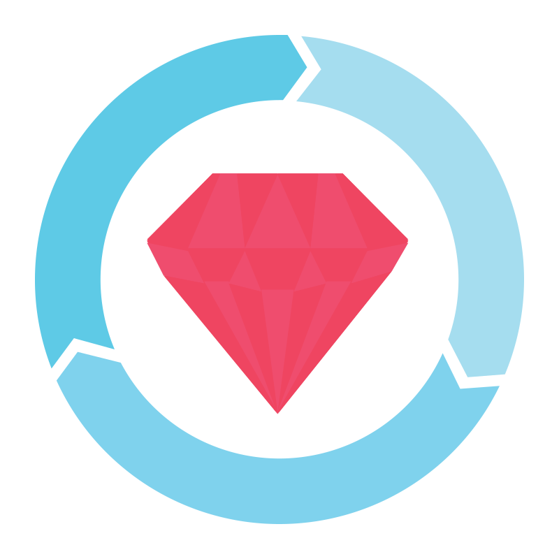

<!--  -->

# Hi! My name is Nick

I am a web developer with diverse experience.

[Mermaid JS](https://github.com/mermaid-js/mermaid) contributor.

Drop me a line if you are interested in collaboration and partnership.
I can be a **developer**, a **team leader** or a **consultant**.
I also have some teaching experience, so you may ask me for **mentoring**.

## Skills

 

My main skills are:

**`Ruby on Rails`**,
**`Ruby`**,
**`RSpec`**,
**`JavaScript`**,
**`React`**,
**`Git`**,
**`Docker`**,
**`Postgres`**,
**`Redis`**,
**`NGinx`**,
**`Linux`**,
**`Github`**,
**`Github Actions`**,
**`Circle CI`**,
**`Rabbit MQ`**,
**`Apache Kafka`**,
**`Go`**,
**`C`**,
**`C++`**,
**`C#`**,
**`Javascript`**,
**`Github Actions`**,
**`Traefik`**,
**`Nomad`**,
**`Terraform`**,
**`Ansible`**,
**`D3`**,
**`Swagger`**,
**`K6`**,
**`Apache Benchmark`**.

## Current interests

Can do a 
**`Fusion360`**,
**`SketchUp`**,
**`3dsMax`**,
**`Unity`**,
**`Graphviz`**.
